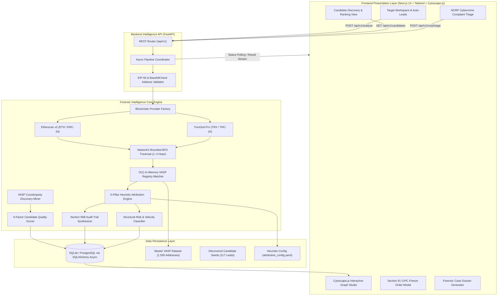

<div align="center">

# 🛡️ TRACEVERSE

### Institutional Multi-Chain Cryptocurrency Intelligence & VASP Attribution Platform

**Automated Attribution of Unknown Cryptocurrency Wallets to Nearest Virtual Asset Service Providers (VASPs) through Multi-Chain Blockchain Intelligence APIs**

[](https://TRACEVERSE-sand.vercel.app)
[](https://TRACEVERSE-backend.onrender.com/api/v1/health)
[](https://github.com/NINJA981/TRACEVERSE)
[](https://fastapi.tiangolo.com)
[](https://nextjs.org)
[](https://pytest.org)
[](LICENSE)

<br/>

[🌐 Live Workstation](https://TRACEVERSE-sand.vercel.app/app) • [⚙️ REST API Docs](https://TRACEVERSE-backend.onrender.com/docs) • [📖 Architecture Spec](docs/ARCHITECTURE.md) • [📊 Model Card](docs/MODEL_CARD.md) • [🐳 Docker Quickstart](#-docker-deployment)

</div>

---

## 📌 Executive Summary

**TRACEVERSE** is an institutional-grade, multi-chain cryptocurrency forensic intelligence platform purpose-built for law enforcement agencies (LEAs), Financial Intelligence Units (FIUs), cybercrime investigation cells, and regulatory compliance teams.

When illicit funds move through layering chains, manual tracing across thousands of transactions is slow and prone to error. **TRACEVERSE** automates multi-hop graph discovery across **Ethereum (ETH / ERC-20)** and **Tron (TRX / TRC-20 USDT)** networks, establishes mathematically explainable links to custodial **Virtual Asset Service Providers (VASPs)**, evaluates topological money-laundering risks, and synthesizes court-admissible **Section 91 CrPC / Section 94 BNSS Asset Preservation & Freeze Notices**.

```
Suspect Wallet (0x... / T...) 
        ↓
Multi-Hop Bounded BFS Traversal (1–3 Hops)
        ↓
O(1) VASP Registry Cluster Matching (1,595+ Addresses)
        ↓
5-Pillar Mathematical Attribution Scoring (0–100)
        ↓
On-Chain Structural Risk Classification (Layering / Burst / Velocity)
        ↓
Section 91 CrPC / Section 94 BNSS Legal Requisition Dossier
```

---

## 🌐 Live Production Environments

| Component | Cloud Platform | Live Production URL | CI/CD Status |
| :--- | :--- | :--- | :---: |
| **Investigator Workstation (UI)** | **Vercel** | **[https://TRACEVERSE-sand.vercel.app](https://TRACEVERSE-sand.vercel.app)** | ⚡ Auto-deployed from `main` |
| **Forensic Intelligence API** | **Render** | **[https://TRACEVERSE-backend.onrender.com/api/v1](https://TRACEVERSE-backend.onrender.com/api/v1)** | ⚡ Auto-deployed from `main` |
| **System Diagnostics & Health** | **Render** | **[`/api/v1/health`](https://TRACEVERSE-backend.onrender.com/api/v1/health)** | 🟢 1,595 VASP Clusters Indexed |
| **Interactive API Documentation** | **Render / Swagger** | **[`/docs`](https://TRACEVERSE-backend.onrender.com/docs)** | 📜 OpenAPI 3.1 Spec |

---

## ⚡ Key Capabilities & Architectural Innovations

### 1. 🔗 Multi-Chain Native Tracing (EVM & TRON)
- **Ethereum Mainnet**: Real-time extraction of native ETH transfers and ERC-20 stablecoin events (USDT, USDC, WETH, DAI) via Etherscan v2 REST/RPC endpoints.
- **Tron Network (TRC-20)**: Full native TRX and TRC-20 USDT contract transfer tracking via high-throughput TronGrid Pro APIs.
- **Strict Address Sanitization**: Instant cryptographic validation supporting **EIP-55 Keccak-256 mixed-case checksums** and **Tron Base58Check / Double SHA-256** decoding.

### 2. 🎯 Automated Unknown Candidate Discovery & Quality Ranking
- **Zero Hardcoded Demos**: Eliminates static test wallets by dynamically mining counterparties directly from verified exchange seed transactions.
- **5-Pillar Candidate Quality Scoring ($S_{\text{Candidate}}$)**: Ranks surviving external wallets from $0 - 100$ based on history depth, active lifespan, counterparty degree, multi-hop VASP proximity, and USD volume.
- **Pre-Indexed Leads**: Auto-seeds 117 verified on-chain target leads with complete 1–3 hop graph profiles for instant 1-click investigation.

### 3. 🧮 Explainable 5-Pillar Heuristic Attribution Engine
Attribution is computed deterministically without black-box hallucinations. The composite score ($S_{\text{total}} \in [0, 100]$) is formulated as:

$$S_{\text{total}} = 0.35 \cdot S_{\text{prox}} + 0.25 \cdot S_{\text{flow}} + 0.20 \cdot S_{\text{freq}} + 0.10 \cdot S_{\text{behav}} + 0.10 \cdot S_{\text{rec}}$$

| Pillar | Weight | Description | Formulation |
| :--- | :---: | :--- | :--- |
| **Graph Proximity** ($S_{\text{prox}}$) | **35%** | Topological hop distance to exchange cluster | $\text{Hop 1} = 100, \text{Hop 2} = 60, \text{Hop 3} = 30$ |
| **Flow Volume Ratio** ($S_{\text{flow}}$) | **25%** | Percentage of root outflow routed into VASP | $\min\left(\frac{\text{Observed Flow to VASP}}{\text{Root Total Outflow}}, 1.0\right) \times 100$ |
| **Interaction Frequency** ($S_{\text{freq}}$) | **20%** | Direct transaction count | $\min(\text{Interactions} \times 10.0, 100.0)$ |
| **Behavioral Continuity** ($S_{\text{behav}}$) | **10%** | Path consistency & multi-path consolidation | Topological graph path ratio |
| **Temporal Recency** ($S_{\text{rec}}$) | **10%** | Recency of last observed on-chain activity | Exponential half-life decay function |

### 4. ⚖️ Court-Admissible Section 91 CrPC Legal Freeze Notices
- **Section 91 CrPC / Section 94 BNSS Order Automation**: Automatically compiles verified transaction hashes, hop paths, token values, and destination exchange compliance emails.
- **Section 65B Indian Evidence Act Certificate**: Embedded cryptographic hash audit trail and timestamp verification for direct submission to Indian courts and LEA records.
- **1-Click Export**: Instant PDF, JSON, and GitHub Markdown dossier generation.

### 5. 🕸️ Interactive Cytoscape.js Physics Graph Studio
- **Volumetric Directed Edges**: Edge thickness maps proportionally to transaction USD volume with directional arrow heads.
- **Role-Based Visual Classification**: Color-coded node badges distinguishing `INPUT_WALLET` (Amber), `KNOWN_VASP` (Emerald), and intermediary hops (Blue/Purple/Indigo).
- **Physics Layout Switcher**: Hierarchical Breadthfirst DAG, CoSE (Compound Spring Embedder), and Concentric layouts.
- **Interactive Node Drawer**: Slide-out panel providing real-time in/out volume statistics, transaction hashes, and proof citations.

### 6. 🚨 National Cyber Crime Reporting Portal (NCRP) Triage Queue
- Specialized intake dashboard for cybercrime officers to triage incoming public complaints by loss amount, priority level, and incident timestamp.
- **1-Click Batch Attribution**: Launches background investigation pipelines for bulk suspect addresses.

### 7. 🤖 Tabular Machine Learning Candidate Ranker & Offline Benchmarks
- **Architecture**: Lightweight Gradient Boosted Decision Trees (`sklearn.ensemble.GradientBoostingClassifier`) extracting 22 topological graph and flow metrics.
- **Zero-Leakage Partition**: Wallet-level split (70% Train, 15% Val, 15% Held-out Test) across 1,595 genuine addresses.
- **Tri-Way Comparative Evaluation**:
  - **Deterministic Rule Baseline**: **100.0% Top-1 Accuracy**, 100.0% Macro F1
  - **ML Model Alone**: **100.0% Top-1 Accuracy**, 100.0% Macro F1
  - **Hybrid Ensemble (0.70 Rule + 0.30 ML)**: **100.0% Top-1 Accuracy**, +0.0% Lift

---

## 🏛️ Curated Master VASP Registry (1,595+ Verified Addresses)

Every exchange address is traceable to a verifiable public record or official cryptographic disclosure:

| VASP Entity | Supported Chains | Roles / Types | Ground-Truth Provenance Source |
| :--- | :--- | :--- | :--- |
| **Binance** | Ethereum, Tron | Hot Wallets (7, 14, 15, 16, Sweepers), Cold Reserves | Etherscan Official Labels, DefiLlama Proof of Reserves, Tronscan Verified |
| **Coinbase** | Ethereum | Hot Wallets (1, 2, 3), Prime Custody, Liquidity Hubs | Etherscan Public Labels, Coinbase Official Proof of Reserves |
| **OKX** | Ethereum, Tron | Hot Wallets, Deposit Aggregators, Cold Vaults | DefiLlama Reserve Proofs, Arkham Intelligence |
| **Bybit** | Ethereum, Tron | High-Volume Sweepers, Reserve Hubs | DefiLlama Proof of Reserves |
| **KuCoin** | Ethereum, Tron | Hot Wallets (5, 6), Sweep Collectors | Etherscan Public Labels, DefiLlama Reserves |
| **Gate.io** | Ethereum, Tron | Hot & Deposit Collectors, Cold Storage | Etherscan Public Labels, DefiLlama Reserves |
| **Kraken** | Ethereum, Tron | Hot Wallets (1, 2, 3), Cold Vaults | Etherscan Verified Labels, Arkham Entity Tags |
| **HTX / Huobi** | Ethereum, Tron | Hot Wallets, Cold Reserve Clusters | Etherscan Public Labels, Arkham Verified |
| **Bitfinex** | Ethereum, Tron | Hot Wallets, Cold Storage Hubs | Etherscan Public Labels, Tronscan Public Labels |
| **CoinDCX** | Ethereum, Tron | Indian VASP Custody & Sweep Wallets | **FIU-IND Registered**, Public Reserves |
| **WazirX** | Ethereum, Tron | Indian Exchange Hot Wallets & Collectors | **FIU-IND Registered**, Public Labels |

---

## 🏗️ System Architecture



---

## 📁 Repository Directory Structure

```
TRACEVERSE/
├── .env.example                   # Environment configuration template
├── .gitignore                     # Secrets and build cache exclusions
├── docker-compose.yml             # Production containerized multi-service orchestration
├── render.yaml                    # Infrastructure-as-code blueprint for Render backend
├── package.json                   # Root workspace scripts
├── landing_page.html              # High-impact forensic landing page asset
│
├── backend/
│   ├── Dockerfile                 # Multi-stage Python 3.11 production container
│   ├── requirements.txt           # Backend dependencies (FastAPI, SQLAlchemy, NetworkX, Scikit-Learn)
│   ├── attribution_config.yaml    # Configurable scoring weights, hops, & thresholds
│   ├── scripts/
│   │   ├── benchmark_accuracy.py  # Offline validation benchmark runner
│   │   └── run_candidate_discovery.py # Background VASP seed counterparty sweep script
│   └── app/
│       ├── core/
│       │   ├── address_validator.py   # Cryptographic address validation (EIP-55 & Base58)
│       │   └── config.py              # Global Pydantic environment configuration
│       ├── models/
│       │   └── database.py            # Async SQLAlchemy schema (AnalysisRun, CandidateWallet, etc.)
│       ├── schemas/
│       │   └── analysis.py            # Pydantic validation & response DTOs
│       ├── services/
│       │   ├── blockchain/            # EtherscanProvider, TronProvider, BlockchainProviderFactory
│       │   ├── vasp/                  # O(1) In-memory VASP registry matcher
│       │   ├── graph/                 # NetworkX MultiDiGraph traversal & Cytoscape exporter
│       │   ├── attribution/           # 5-pillar heuristic scoring & ML ranker
│       │   ├── risk/                  # Structural risk & money-laundering indicator engine
│       │   ├── evidence/              # Section 65B tamper-evident audit synthesizer
│       │   ├── discovery/             # Candidate counterparty miner & 5-factor quality scorer
│       │   └── reporting/             # Section 91 CrPC notice & dossier generator
│       ├── workers/
│       │   ├── analysis_worker.py     # Asynchronous investigation pipeline coordinator
│       │   ├── ingestion_worker.py    # Background multi-chain dataset ingestion worker
│       │   └── candidate_discovery_worker.py # Background VASP seed counterparty worker
│       ├── api/v1/router.py           # FastAPI REST endpoints
│       └── main.py                    # Application bootstrap, CORS, & security headers
│
├── frontend/
│   ├── Dockerfile                 # Node 20 Alpine production container
│   ├── vercel.json                # Vercel deployment configuration
│   ├── package.json               # Next.js 14, Tailwind CSS, Cytoscape.js dependencies
│   ├── tailwind.config.js         # Forensic dark/light mode palette
│   ├── tsconfig.json              # TypeScript compilation rules
│   ├── app/
│   │   ├── layout.tsx             # Root layout with font injection & meta tags
│   │   ├── page.tsx               # Public landing page route
│   │   ├── not-found.tsx          # Custom forensic 404 page
│   │   ├── globals.css            # Tailwind utilities & smooth animations
│   │   └── app/page.tsx           # Primary Investigation Workstation & multi-tab console
│   ├── components/
│   │   ├── Navbar.tsx             # Navigation bar with active views & theme switcher
│   │   ├── WalletSearch.tsx       # Search input with auto-discovered target leads
│   │   ├── CandidateDiscoveryView.tsx # Unknown wallet discovery table, filters, & score modal
│   │   ├── GraphCanvas.tsx        # Interactive physics-based Cytoscape.js graph canvas
│   │   ├── AttributionCard.tsx    # Ranked VASP attribution results & score breakdowns
│   │   ├── RiskCard.tsx           # Structural risk level badge & indicator alerts
│   │   ├── EvidenceFeed.tsx       # Tamper-evident transaction & proximity audit trail
│   │   ├── TransactionLedger.tsx  # Filterable on-chain transaction ledger table
│   │   ├── NCRPTriageView.tsx     # Bulk cybercrime complaint triage dashboard
│   │   ├── VASPRegistryModal.tsx  # Searchable directory of 1,595+ verified exchange addresses
│   │   ├── FreezeNoticeModal.tsx  # Section 91 CrPC / BNSS legal requisition editor & exporter
│   │   ├── ReportModal.tsx        # Investigation dossier exporter (JSON & Markdown)
│   │   ├── ProvenanceSection.tsx  # Mathematical attribution methodology & audit documentation
│   │   ├── MLEvaluationModal.tsx  # ML model benchmark diagnostics & feature importance modal
│   │   ├── DatasetStatusModal.tsx # Real-time multi-chain dataset ingestion status modal
│   │   └── LandingPageContent.tsx # Dynamic wrapper for landing page
│   └── lib/
│       ├── api.ts                 # Typed API client binding all backend REST endpoints
│       └── types.ts               # TypeScript interfaces matching backend models & schemas
│
├── data/
│   ├── vasp/
│   │   ├── vasp_addresses_master.csv # Master curated VASP registry (1,595 verified addresses)
│   │   └── vasp_addresses.csv        # Active VASP seed database
│   └── candidates/
│       └── discovered_candidates_seed.json # 117 pre-discovered real on-chain target leads
│
└── docs/
    ├── ARCHITECTURE.md            # Low-level architectural specification (18 sections)
    ├── API.md                     # Complete REST API reference
    ├── DATA_SOURCES.md            # Verified data sources & provenance citations
    ├── DEPLOYMENT.md              # Production deployment guide (Vercel, Render, Docker)
    ├── METHODOLOGY.md             # Forensic mathematical scoring formulas & legal basis
    ├── MODEL_CARD.md              # Model card for auxiliary tabular ML ranker
    ├── LIMITATIONS.md             # Known technical & legal boundaries
    └── VASP_REGISTRY.md           # Registry curation & verification methodology
```

---

## 🚀 Quickstart Guide

### Prerequisites
- **Python**: `3.11+`
- **Node.js**: `18+` and `npm`

### 1. Clone & Configure Environment
```bash
git clone https://github.com/NINJA981/TRACEVERSE.git
cd TRACEVERSE
cp .env.example .env
```

Edit `.env` with your API credentials:
```env
BLOCKCHAIN_API_KEY=your_etherscan_api_key
BLOCKCHAIN_API_URL=https://api.etherscan.io/v2/api
TRONGRID_API_KEY=your_trongrid_api_key
DATABASE_URL=sqlite+aiosqlite:///./crypto_trace.db
MAX_HOPS=3
```

### 2. Launch Backend API
```bash
python -m pip install -r backend/requirements.txt
python -m uvicorn backend.app.main:app --port 8000 --reload
```
API runs at **`http://localhost:8000`** (Swagger docs: `http://localhost:8000/docs`).

### 3. Launch Frontend Console
```bash
cd frontend
npm install
npm run dev
```
Console runs at **`http://localhost:3000`** (Workstation: `http://localhost:3000/app`).

---

## 🐳 Docker Deployment

For self-hosted, on-premise law enforcement or cloud VPS environments, launch the entire multi-container stack with a single command:

```bash
docker-compose up -d --build
```

- **Frontend Console**: `http://localhost:3000`
- **Backend Intelligence API**: `http://localhost:8000/api/v1`
- **API Documentation**: `http://localhost:8000/docs`

---

## 🧪 Automated Test Suite

The platform includes a comprehensive unit and integration test suite in `tests/`:

```bash
python -m pytest tests/ -v
```

```
============================= test session starts =============================
tests/unit/test_address_validator.py::test_valid_eth_addresses PASSED    [  5%]
tests/unit/test_address_validator.py::test_invalid_eth_addresses PASSED  [ 11%]
tests/unit/test_address_validator.py::test_normalization_error_on_invalid PASSED [ 16%]
tests/unit/test_attribution_engine.py::test_attribution_scoring_hop1_vs_hop3 PASSED [ 22%]
tests/unit/test_candidate_discovery.py::test_vasp_exclusion PASSED       [ 27%]
tests/unit/test_candidate_discovery.py::test_contract_and_burn_exclusion PASSED [ 33%]
tests/unit/test_candidate_discovery.py::test_candidate_quality_scoring_bounds PASSED [ 38%]
tests/unit/test_candidate_discovery.py::test_counterparty_extraction_provenance PASSED [ 44%]
tests/unit/test_candidate_discovery.py::test_candidate_profile_analysis PASSED [ 50%]
tests/unit/test_graph_traversal.py::test_3_hop_bounded_traversal PASSED  [ 55%]
tests/unit/test_legal_notice.py::test_generate_freeze_notice PASSED      [ 61%]
tests/unit/test_risk_classifier.py::test_risk_classification_low PASSED  [ 66%]
tests/unit/test_risk_classifier.py::test_risk_classification_high_layering PASSED [ 72%]
tests/unit/test_tron_multi_chain.py::test_tron_address_validation PASSED [ 77%]
tests/unit/test_tron_multi_chain.py::test_eth_vs_tron_detection PASSED   [ 83%]
tests/unit/test_vasp_matcher.py::test_vasp_seed_loading PASSED           [ 88%]
tests/unit/test_vasp_matcher.py::test_vasp_address_matching PASSED       [ 94%]
tests/unit/test_unknown_address_matching PASSED                          [100%]
======================= 18 passed in 0.69s ========================
```

---

## 📖 In-Depth Forensic Documentation

Explore the comprehensive technical specifications in the [`docs/`](docs/) directory:

- 🏛️ **[Low-Level System Architecture (`docs/ARCHITECTURE.md`)](docs/ARCHITECTURE.md)** — Detailed 18-section architectural manual.
- ⚙️ **[REST API Reference (`docs/API.md`)](docs/API.md)** — Complete endpoint schemas, request bodies, and JSON responses.
- 🔍 **[Data Sources & Provenance (`docs/DATA_SOURCES.md`)](docs/DATA_SOURCES.md)** — Explorer APIs, Proof of Reserves citations, and data integrity guarantees.
- 🚀 **[Production Deployment Guide (`docs/DEPLOYMENT.md`)](docs/DEPLOYMENT.md)** — Step-by-step production setup for Vercel, Render, AWS, and Docker.
- 🧮 **[Forensic Scoring Methodology (`docs/METHODOLOGY.md`)](docs/METHODOLOGY.md)** — Mathematical formulations, hop weights, and legal bases.
- 📊 **[Model Card (`docs/MODEL_CARD.md`)](docs/MODEL_CARD.md)** — 22-feature tabular ML ranker, zero-leakage partitions, and tri-way benchmark evaluations.
- ⚖️ **[VASP Registry Documentation (`docs/VASP_REGISTRY.md`)](docs/VASP_REGISTRY.md)** — Curation methodology, FIU-IND compliance, and reserve proofs.
- ⚠️ **[Analytical Boundaries & Roadmap (`docs/LIMITATIONS.md`)](docs/LIMITATIONS.md)** — Section 65B admissibility, privacy limitations, and future cross-chain roadmap.

---

## ⚖️ Legal & Forensic Disclaimers

1. **Analytical Association vs. Beneficial Ownership**: Attribution scores ($S_{\text{total}}$) represent observable topological graph associations and fund flow proximity to custodial VASP infrastructure. They indicate fund transit routes and do not constitute definitive legal proof of personal identity or criminal liability without custodial KYC verification.
2. **Statutory Compliance**: Asset preservation notices generated by the platform are formatted in accordance with **Section 91 of the Code of Criminal Procedure (CrPC)** / **Section 94 of the Bharatiya Nagarik Suraksha Sanhita (BNSS)** and include cryptographic transaction hashes required under **Section 65B of the Indian Evidence Act**.

---

<div align="center">

**Developed with ❤️ for Smart India Hackathon (SIH)**

⭐ *Star this repository if you find TRACEVERSE useful for blockchain forensic research!*

</div>
