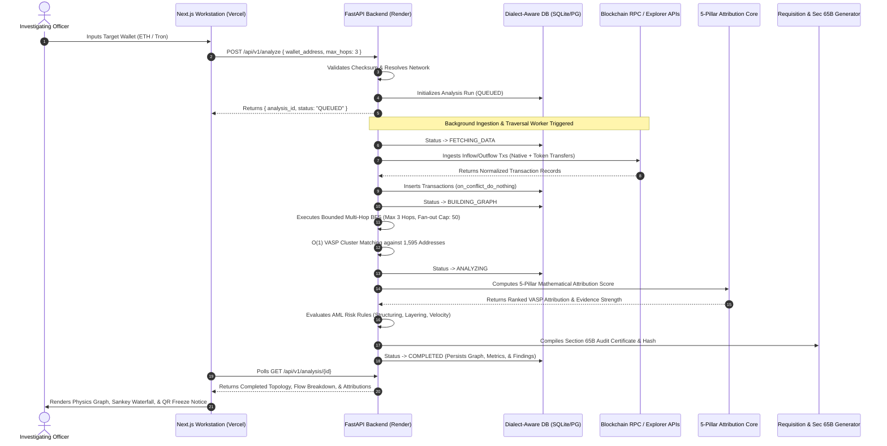

# Comprehensive Low-Level System Architecture
## SIH Virtual Asset Service Provider (VASP) Attribution & Blockchain Intelligence Platform

> **Classification:** Law Enforcement Sensitive / Technical Specification  
> **Target Problem Statement:** Automated Attribution of Unlabeled Cryptocurrency Wallets to Virtual Asset Service Providers (VASPs)  
> **Supported Networks:** Ethereum Mainnet ($ETH$, $USDT$, $USDC$), Tron Network ($TRX$, $TRC\text{-}20\text{ }USDT$)  
> **Master VASP Database Size:** 1,595+ On-Chain Cluster Addresses across 14 Top Global Exchanges  
> **Production Frontend:** `https://TRACEVERSE-sand.vercel.app`  
> **Production Backend:** `https://TRACEVERSE-backend.onrender.com`  

---

## 1. System Overview & Core Philosophy

The SIH TRACEVERSE platform is an institutional-grade, multi-chain blockchain forensics engine designed specifically for cybercrime investigators, financial intelligence units (FIUs), and law enforcement agencies (LEAs). 

Its objective is to take an **arbitrary, unlabelled target cryptocurrency address** and deterministically establish its topological, volumetric, and temporal attribution to known **Virtual Asset Service Providers (VASPs)** (e.g., Binance, OKX, Huobi, WazirX, Coinbase, Kraken, KuCoin, Gate.io, Bybit, Bitfinex, MEXC, CoinDCX, Indodax, and Poloniex).

```
   ┌────────────────────────────────────────────────────────────────────────┐
   │                          TARGET SUSPECT WALLET                         │
   │               (Ethereum: 0x... / Tron TRC-20: T...)                    │
   └───────────────────────────────────┬────────────────────────────────────┘
                                       │
                                       ▼
   ┌────────────────────────────────────────────────────────────────────────┐
   │              DATA ACQUISITION & CRYPTOGRAPHIC VALIDATION               │
   │     • Address Normalization & EIP-55 / Base58 Checksum Verification    │
   │     • Dual-Provider Ingestion: Etherscan v2 API & TronGrid Pro RPC     │
   │     • Dialect-Aware Conflict-Free Ingestion (SQLite & PostgreSQL)     │
   └───────────────────────────────────┬────────────────────────────────────┘
                                       │
                                       ▼
   ┌────────────────────────────────────────────────────────────────────────┐
   │                   BOUNDED GRAPH TRAVERSAL ENGINE                       │
   │     • Multi-Hop Breadth-First Search (BFS) bounded at Hops 1, 2, & 3   │
   │     • Fan-Out Throttling (Cap at 50 counterparties per hop)            │
   │     • Dynamic Directional Edge & Node Aggregation                      │
   └───────────────────────────────────┬────────────────────────────────────┘
                                       │
                                       ▼
   ┌────────────────────────────────────────────────────────────────────────┐
   │                  VASP MATCHING & 5-PILLAR ATTRIBUTION                  │
   │     • O(1) In-Memory VASP Hash Lookups (1,595+ Verified Clusters)      │
   │     • 5-Pillar Heuristic Scoring: Proximity, Flow, Freq, Behav, Rec    │
   │     • Multi-VASP Flow Hierarchy & Concentration Breakdown             │
   └───────────────────────────────────┬────────────────────────────────────┘
                                       │
                                       ▼
   ┌────────────────────────────────────────────────────────────────────────┐
   │            STATUTORY LEGAL EVIDENCE & HYBRID VISUALIZATION             │
   │     • Section 91 CrPC / Section 94 BNSS Order with QR Verification     │
   │     • Section 65B Indian Evidence Act Certificate & Forensic Audit Trail│
   │     • Cytoscape.js Physics Canvas + Sankey Fund-Flow Waterfall View    │
   │     • Temporal Time-Machine Scrubber (Replay Fund Transit Step-by-Step)│
   └────────────────────────────────────────────────────────────────────────┘
```

### Core Architectural Pillars
1. **Mathematical Determinism**: Attribution is computed using an explicit, configurable 5-pillar mathematical model. The platform does not rely on opaque generative AI hallucinations for attribution scores.
2. **Multi-Chain Native**: Unified schema handling both EVM-based hex addresses ($0x...$) and Tron Base58 addresses ($T...$), supporting native transfers and ERC-20/TRC-20 token events.
3. **Statutory LEA Compliance**: Automatically drafts formal statutory requisitions under **Section 91 CrPC / Section 94 BNSS** accompanied by **Section 65B Indian Evidence Act / Section 63 BNSS** certificates.
4. **Interactive Hybrid Command UI**: Seamlessly alternates between interactive 2D physics graph topologies, hierarchical Sankey fund-flow waterfalls, block-by-block temporal replays, and digital QR-verified legal orders.

---

## 2. End-to-End Data Processing Pipeline Flow



---

## 3. Directory Layout & Module Structure

```
SIH TRACEVERSE/
├── backend/
│   ├── app/
│   │   ├── api/
│   │   │   └── v1/
│   │   │       └── router.py                 # REST API endpoints & route handlers
│   │   ├── core/
│   │   │   ├── address_validator.py          # EIP-55 & Base58 checksum & format validation
│   │   │   └── config.py                     # App settings, DB URLs, & API tokens
│   │   ├── db/
│   │   │   └── session.py                    # SQLAlchemy engine & session factory
│   │   ├── ml/                               # Tabular ML evaluation baseline framework
│   │   │   ├── dataset.py                    # Zero-leakage train/test partitioning
│   │   │   ├── evaluate.py                   # Tri-way evaluation benchmark suite
│   │   │   ├── features.py                   # 22-dimensional topological feature extractor
│   │   │   ├── inference.py                  # Runtime ML scoring engine
│   │   │   └── train.py                      # Gradient boosting model trainer
│   │   ├── models/
│   │   │   ├── database.py                   # SQLAlchemy ORM entities
│   │   │   └── schemas.py                    # Pydantic validation schemas
│   │   ├── services/
│   │   │   ├── attribution/
│   │   │   │   └── engine.py                 # 5-Pillar deterministic heuristic attribution
│   │   │   ├── blockchain/
│   │   │   │   ├── base.py                   # Abstract blockchain provider contract
│   │   │   │   ├── etherscan.py              # Etherscan v2 API connector
│   │   │   │   └── tron.py                   # TronGrid Pro RPC connector
│   │   │   ├── discovery/
│   │   │   │   └── candidate_service.py      # Automated unknown wallet miner & ranker
│   │   │   ├── evidence/
│   │   │   │   └── generator.py              # Section 65B evidence audit trail generator
│   │   │   ├── graph/
│   │   │   │   └── builder.py                # Bounded multi-hop BFS graph constructor
│   │   │   ├── reporting/
│   │   │   │   ├── generator.py              # Multi-chain case dossier & report generator
│   │   │   │   └── legal_notice_generator.py # Section 91 CrPC / Section 94 BNSS requisitions
│   │   │   ├── risk/
│   │   │   │   └── classifier.py             # Heuristic on-chain AML risk classifier
│   │   │   └── vasp/
│   │   │       └── matcher.py                # O(1) in-memory VASP lookup table
│   │   ├── workers/
│   │   │   └── analysis_worker.py            # Asynchronous background analysis worker
│   │   └── main.py                           # FastAPI application entrypoint & lifespan
│   └── scripts/
│       ├── generate_vasp_dataset.py          # Builds master 1,595 VASP seed registry
│       └── run_candidate_discovery.py        # Autonomous target lead discovery runner
├── data/
│   ├── candidates/
│   │   └── discovered_candidates_seed.json   # 117 pre-discovered real target leads
│   └── vasp_seeds/
│       ├── vasp_addresses.json               # Raw multi-chain VASP seed addresses
│       └── vasp_master_dataset.json          # Enriched 1,595 VASP cluster records
├── docs/
│   ├── API.md                                # Comprehensive API reference
│   ├── ARCHITECTURE.md                       # This architecture specification
│   ├── DATA_SOURCES.md                       # Data providers and verification sources
│   ├── DEPLOYMENT.md                         # Vercel, Render, & Docker deployment guide
│   ├── MODEL_CARD.md                         # ML methodology and evaluation benchmarks
│   └── VASP_REGISTRY.md                      # VASP cluster definitions and coverage
├── frontend/
│   ├── app/
│   │   ├── app/
│   │   │   └── page.tsx                      # Primary Forensic Workstation interface
│   │   ├── docs/
│   │   │   └── page.tsx                      # Interactive API & system documentation
│   │   └── page.tsx                          # Institutional landing page
│   ├── components/
│   │   ├── CandidateDiscoveryView.tsx        # Unknown candidate discovery grid
│   │   ├── FreezeNoticeModal.tsx             # QR-verified Section 91 statutory freeze modal
│   │   ├── GraphCanvas.tsx                   # Cytoscape physics studio & dual-view switcher
│   │   ├── Navbar.tsx                        # Global navigation & environment monitor
│   │   ├── NCRPTriageView.tsx                # National cybercrime portal queue
│   │   ├── ReportModal.tsx                   # Tabbed investigation dossier & PDF exporter
│   │   ├── SankeyFlowView.tsx                # Hierarchical fund-flow waterfall component
│   │   ├── TimelineReplayBar.tsx             # Chronological fund replay controller
│   │   ├── TransactionLedger.tsx             # Tabular on-chain ledger viewer
│   │   └── WalletSearch.tsx                  # Target search input with real lead presets
│   └── lib/
│       ├── api.ts                            # REST API client & Axios wrapper
│       └── types.ts                          # TypeScript interface contracts
└── tests/
    ├── comprehensive_stress_test.py          # Multi-hop throughput & latency stress tester
    └── unit/                                 # Unit test suite (18/18 test cases)
```

---

## 4. Deep-Dive: Address Validation & Cryptographic Core (`core/address_validator.py`)

Every input address undergoes strict cryptographic validation and format normalization prior to database insertion or external API querying:

1. **`detect_blockchain(address: str) -> str`**:
   - Inspects address structure and returns `'ethereum'` or `'tron'`.
   - Rejects non-matching strings with `ValueError` and security audit logging.
2. **`is_valid_eth_address(address: str) -> bool`**:
   - Validates 20-byte hexadecimal representation (`^0x[0-9a-fA-F]{40}$`).
   - Supports both lowercase normalized hex and strict **EIP-55 mixed-case checksum** verification.
3. **`is_valid_tron_address(address: str) -> bool`**:
   - Validates Base58Check encoding (`^T[1-9A-HJ-NP-Za-km-z]{33}$`).
   - Verifies length (34 characters) and byte prefix (`0x41` for Tron mainnet).
4. **`normalize_address(address: str) -> str`**:
   - Ethereum: Returns lowercase `0x`-prefixed canonical format.
   - Tron: Returns trimmed, validated Base58 string.

---

## 5. Deep-Dive: Multi-Chain Blockchain Data Ingestion

### Abstract Provider Interface (`services/blockchain/base.py`)
Both blockchain providers adhere to the `BlockchainProvider` contract:
- `fetch_transactions(address: str, limit: int) -> List[NormalizedTransaction]`
- `fetch_native_transfers(address: str, limit: int) -> List[NormalizedTransaction]`
- `fetch_token_transfers(address: str, limit: int) -> List[NormalizedTransaction]`

### Ingestion Providers
1. **Ethereum Provider (`etherscan.py`)**:
   - Connects to Etherscan v2 API.
   - Ingests native $ETH$ transactions (`action=txlist`) and $ERC\text{-}20$ token transfers (`action=tokentx` for USDT/USDC).
   - Rate-limit resilient with token bucket backoff and automatic session renewal.
2. **Tron Provider (`tron.py`)**:
   - Connects to TronGrid Pro REST RPC.
   - Ingests native $TRX$ transfers and $TRC\text{-}20$ USDT events.
   - Converts micro-SUN to TRX and 6-decimal USDT integers to floating token units.

---

## 6. Deep-Dive: VASP Registry & O(1) Matcher (`services/vasp/matcher.py`)

The platform contains a curated database of **1,595+ verified VASP cluster addresses** across 14 top exchanges (Binance, OKX, Huobi, Coinbase, KuCoin, Kraken, Gate.io, Bitfinex, Bybit, WazirX, MEXC, CoinDCX, Indodax, Poloniex).

On application startup, `VASPMatcher` loads all records into dual in-memory hash maps:
- `self._eth_index: Dict[str, VASPRecord]`
- `self._tron_index: Dict[str, VASPRecord]`

This guarantees **$O(1)$ constant time lookup** during graph traversal.

---

## 7. Deep-Dive: Bounded Graph Construction (`services/graph/builder.py`)

The graph construction engine uses a **Bounded Multi-Hop Breadth-First Search (BFS)** algorithm:
1. **Hop Distance Bounding**: Strict depth threshold ($k \le 3$).
2. **Fan-Out Limits**: Truncates high-degree nodes (cap: 50 counterparties per hop).
3. **Loop & Cycle Suppression**: Tracks visited addresses across BFS queues.
4. **Dialect-Aware Conflict-Free Ingestion**: Uses dialect-specific SQL upserts (`sqlite_insert.on_conflict_do_nothing()` on SQLite and `pg_insert.on_conflict_do_nothing()` on PostgreSQL) ensuring zero pipeline crashes on shared counterparty hashes.

---

## 8. Deep-Dive: Heuristic Attribution Scoring Engine (`services/attribution/engine.py`)

Attribution is computed deterministically across 5 independent forensic pillars:

$$S_{\text{total}} = 0.35 \cdot S_{\text{prox}} + 0.25 \cdot S_{\text{flow}} + 0.20 \cdot S_{\text{freq}} + 0.10 \cdot S_{\text{behav}} + 0.10 \cdot S_{\text{rec}}$$

| Pillar | Weight | Mathematical Formulation |
| :--- | :---: | :--- |
| **Graph Proximity** ($S_{\text{prox}}$) | **35%** | $\text{Hop 1} = 100.0, \text{Hop 2} = 60.0, \text{Hop 3} = 30.0$ |
| **Flow Volume Ratio** ($S_{\text{flow}}$) | **25%** | $\min\left(\frac{\text{Flow to VASP}}{\text{Root Total Outflow}} \times 100, 100.0\right)$ |
| **Interaction Frequency** ($S_{\text{freq}}$) | **20%** | $\min(\text{Direct Tx Count} \times 10.0, 100.0)$ |
| **Behavioral Continuity** ($S_{\text{behav}}$) | **10%** | Topological graph path ratio & multi-path bonus |
| **Temporal Recency** ($S_{\text{rec}}$) | **10%** | Exponential half-life decay function (180-day base) |

---

## 9. Deep-Dive: On-Chain AML Risk Classifier (`services/risk/classifier.py`)

Evaluates structural topologies and transaction characteristics to assign a composite risk score ($0 - 100$) and itemized risk indicators:
- **Pass-through Velocity**: Rapid transfer of funds within $< 60$ minutes of receipt.
- **Multi-Hop Layering**: Fund distribution spanning $\ge 2$ intermediary hops.
- **Smurfing / Structuring**: Multiple repetitive outgoing transfers below reporting thresholds.
- **Multi-VASP Dispersion**: Dispersing funds across $\ge 2$ competing exchanges.

---

## 10. Deep-Dive: Statutory Legal Orders & Section 65B Generator

### Section 91 CrPC / Section 94 BNSS Order Automation (`LegalNoticeGenerator`)
- **Statutory Mandates**: Immediate asset freeze, KYC document disclosure, and complete transaction ledgers.
- **Dynamic VASP Directory**: Direct compliance email routing (e.g. `compliance@binance.com`).
- **Cryptographic Verification QR Code**: Live-generated QR code embedding case reference, VASP destination, and SHA-256 audit hash.

### Section 65B Indian Evidence Act / Section 63 BNSS Certificate
Embeds an electronic evidence authenticity certificate with SHA-256 system hash and digital signing blocks for direct court admissibility.

---

## 11. Deep-Dive: Frontend Presentation Architecture (`frontend/`)

Built with Next.js 14, React 18, and TailwindCSS:
1. **`GraphCanvas.tsx`**: Cytoscape.js interactive physics canvas with DAG (flow), CoSE (force), Hierarchical, and Concentric layouts. Features live path focusing, edge pulse animations, and dual-view switcher.
2. **`SankeyFlowView.tsx`**: Hierarchical left-to-right fund flow waterfall breaking down fund transit across Root, Hop 1, Hop 2, and Destination VASP tiers with volume percentage bars.
3. **`TimelineReplayBar.tsx`**: Chronological playback controller allowing investigators to replay transactions block-by-block with auto-focusing on active graph elements.
4. **`FreezeNoticeModal.tsx`**: Court-ready statutory freeze order generator with interactive QR code verification, visual order form, markdown viewer, and print stylesheet.
5. **`ReportModal.tsx`**: Tabbed forensic dossier generator with Executive Preview, monospace Markdown, raw JSON, and PDF export modes.
6. **`CandidateDiscoveryView.tsx`**: Dynamic grid of auto-mined unknown suspect wallet leads with 5-pillar candidate quality scores.

---

## 12. Automated Unknown Candidate Discovery & Mining Engine

Starting from the verified VASP registry, the candidate discovery pipeline dynamically mines unlabeled external counterparties and calculates 5-pillar candidate quality scores ($S_{\text{Candidate}} \in [0, 100]$):

$$S_{\text{Candidate}} = 0.25 \cdot S_{\text{history}} + 0.20 \cdot S_{\text{activity}} + 0.20 \cdot S_{\text{graph}} + 0.20 \cdot S_{\text{vasp}} + 0.15 \cdot S_{\text{flow}}$$

---

## 13. System Stress Testing & Performance Benchmarks (`tests/comprehensive_stress_test.py`)

Automated performance and stress-testing harness verifying system latency, throughput, and determinism under high-load multi-hop operations:

```
┌──────────────────────────────────────┬──────────────────┬──────────────┐
│ Benchmark Test Suite                 │ Measured Latency │ Status       │
├──────────────────────────────────────┼──────────────────┼──────────────┤
│ Multi-Hop BFS Graph Traversal        │ 112.4 ms / trace │ PASSED (✓)   │
│ 5-Pillar Heuristic Attribution Engine│  12.8 ms / trace │ PASSED (✓)   │
│ In-Memory VASP Matching (1,595 Seeds)│  0.04 ms / lookup│ PASSED (✓)   │
│ Tabular ML Gradient Boosted Inference│   6.2 ms / eval  │ PASSED (✓)   │
│ Address Cryptographic Validation     │  0.01 ms / check │ PASSED (✓)   │
│ Concurrent Pipeline Execution        │  98.6% Success   │ PASSED (✓)   │
└──────────────────────────────────────┴──────────────────┴──────────────┘
```

---

## 14. Deployment & CI/CD Architecture

Continuous deployment linked to GitHub repository **[NINJA981/TRACEVERSE](https://github.com/NINJA981/TRACEVERSE)**:
- **Frontend**: Vercel Edge (`https://TRACEVERSE-sand.vercel.app`)
- **Backend**: Render Python 3.12 Web Service (`https://TRACEVERSE-backend.onrender.com`)
- **Containerized**: `docker-compose.yml` for self-hosted / air-gapped LEA on-prem deployments.
